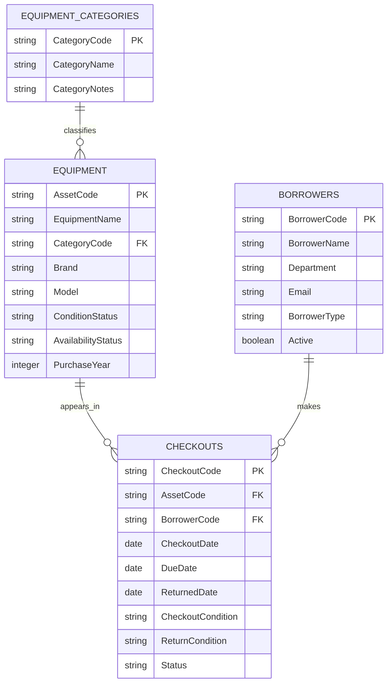

# Campus Equipment Checkout System
## Instructor Demonstration Report — Database Technology

> **Teaching-only notice:** This is a fictional instructor-created example and a prototype reference. It is not a student submission template. The records are synthetic. Students must independently create their own case, initial data representation, functional dependencies, anomaly analysis, normalization, ERD, and implementation.

## Project summary
**System:** Campus Equipment Checkout System (CECS)  
**Purpose:** Track equipment inventory, borrowers, checkout transactions, due dates, and return condition.

### Business assumptions
1. Each item has a unique `asset_code`.
2. Each borrower has a unique `borrower_code`.
3. Each checkout transaction has a unique `checkout_code`.
4. A checkout transaction concerns one equipment item and one borrower.
5. A piece of equipment can appear in many checkout transactions over time, but should not have multiple active checkouts simultaneously. This prototype does not yet enforce that last rule in the database.
6. Equipment belongs to one category.
7. The example data and identities are entirely fictional.

# Chapter 1 — Case Description

## 1.1 Background
Universities and teaching labs lend equipment such as laptops, projectors, cameras, and networking devices to students and staff. When inventory, borrower details, and checkout history are maintained in one spreadsheet or copied into multiple sheets, staff can struggle to identify the current holder of an item, check due dates, and trace equipment condition before and after borrowing.

## 1.2 Business problem
The proposed case is a small equipment checkout workflow. Staff need to know which assets exist, what category each asset belongs to, who borrowed an item, when it is due, whether it has been returned, and what condition was recorded at checkout and return.

## 1.3 Objectives
- Centralize equipment and category records.
- Record borrowing and return transactions.
- Maintain borrower information separately from transaction history.
- Trace each checkout to one asset and one borrower.
- Demonstrate normalization, referential integrity, and a basic web dashboard.

## 1.4 Users and use cases
- **Equipment coordinator:** maintain assets and categories.
- **Borrower:** request/collect equipment and return it.
- **Teaching staff:** check availability before a class.
- **Manager:** review overdue and maintenance counts.

## 1.5 Scope
The demo includes equipment, categories, borrowers, checkout transactions, and a dashboard. It does not include approval workflows, reservations, authentication, barcode scanning, email reminders, or an actual booking calendar.

# Chapter 2 — Sample Data in UNF

## 2.1 What the UNF representation means here
UNF is shown as an initial conceptual record containing a repeating group of equipment checkout history entries for a borrower or an inventory item. This is a deliberate teaching representation, not a claim that every spreadsheet is automatically UNF.

## 2.2 Illustrative UNF structure

`BORROWER_UNF(BorrowerCode, BorrowerName, Department, Email, BorrowerType, {CheckoutCode, AssetCode, EquipmentName, CategoryName, CheckoutDate, DueDate, ReturnedDate, CheckoutCondition, ReturnCondition, CheckoutStatus})`

The braces represent a repeating group of checkout entries. One borrower may have multiple checkout transactions over time.

## 2.3 Synthetic sample data

| BorrowerCode | BorrowerName | Department | Repeating checkout entries |
|---|---|---|---|
| BR-2001 | Nadia Example | Digital Media | CO-3001 / EQ-1002 / Wireless Microphone Set / due 2026-10-04 / Borrowed |
| BR-2002 | Rafi Sample | Computer Science | CO-3002 / EQ-1003 / Teaching Laptop 14-inch / due 2026-09-29 / Returned |
| BR-2003 | Mira Demo | Learning Services | CO-3003 / EQ-1005 / Wi-Fi Access Point / due 2026-09-12 / Returned |
| BR-2004 | Dimas Fiction | Computer Science | CO-3004 / EQ-1007 / Document Camera / due 2026-10-08 / Borrowed |
| BR-2005 | Sinta Placeholder | Engineering Lab | CO-3005 / EQ-1004 / USB-C Docking Station / due 2026-09-22 / Returned |

All sample people and records are fictional. Email addresses use the reserved `.invalid` domain.

## 2.4 Why the initial representation needs refinement
A borrower can have multiple checkout entries. If checkout details are stored as a comma-separated list or repeated columns, querying an individual transaction and enforcing relationships becomes difficult. Asset names and category names may also be repeated across checkout entries. The normalized design separates borrowers, equipment, categories, and checkout transactions.

# Chapter 3 — Anomalies and Functional Dependencies

> This is an illustrative instructor analysis. Students must derive and justify their own dependencies and anomalies from the case they choose.

## 3.1 Potential anomalies
- **Update anomaly:** changing a borrower's department when that value is copied into many transaction records requires multiple updates.
- **Update anomaly:** changing an equipment name or category label across many checkout rows may leave inconsistent descriptions.
- **Insertion anomaly:** an equipment asset may be hard to register if the initial structure requires a checkout to exist first.
- **Insertion anomaly:** a new borrower may be difficult to add before they have borrowed equipment.
- **Deletion anomaly:** deleting the only checkout record for a borrower could remove the only copy of their contact or department information.
- **Deletion anomaly:** deleting the last checkout involving an asset could remove the only place where its descriptive information is stored.

## 3.2 Illustrative candidate keys and functional dependencies
Under the assumptions above:
- `BorrowerCode → BorrowerName, Department, Email, BorrowerType, Active`
- `AssetCode → EquipmentName, CategoryCode, Brand, Model, ConditionStatus, AvailabilityStatus, PurchaseYear`
- `CategoryCode → CategoryName, CategoryNotes`
- `CheckoutCode → AssetCode, BorrowerCode, CheckoutDate, DueDate, ReturnedDate, CheckoutCondition, ReturnCondition, Status, Notes`

These dependencies assume the business codes are unique. The implementation uses generated numeric primary keys and unique business codes.

## 3.3 Questions to discuss
- Which attributes describe a borrower independently of any checkout?
- Which attributes describe an asset independently of its checkout history?
- Does equipment availability belong only in the asset table, or should active checkout records also determine it?
- What rule prevents two active checkouts for the same asset?
- Would a separate `staff` or `department` table improve the design?

# Chapter 4 — Step-by-Step Normalization

This is one possible decomposition based on the stated assumptions. The exact result depends on the business rules and dependencies justified for a chosen case.

## 4.1 UNF
`BORROWER_UNF(BorrowerCode, BorrowerName, Department, Email, BorrowerType, {CheckoutCode, AssetCode, EquipmentName, CategoryName, CheckoutDate, DueDate, ReturnedDate, CheckoutCondition, ReturnCondition, CheckoutStatus})`

The repeating group contains multiple checkout transactions for one borrower.

## 4.2 First Normal Form (1NF)
Represent each checkout entry as a separate row with atomic values:

`BORROWING_1NF(BorrowerCode, BorrowerName, Department, Email, BorrowerType, CheckoutCode, AssetCode, EquipmentName, CategoryName, CheckoutDate, DueDate, ReturnedDate, CheckoutCondition, ReturnCondition, CheckoutStatus)`

Under these assumptions, `CheckoutCode` can identify a checkout row. Borrower details, asset details, and category details are repeated when the same entities appear in multiple transactions.

## 4.3 Second Normal Form (2NF)
If the chosen candidate key for the initial flat relation is a single `CheckoutCode`, there are no partial dependencies on part of a composite key, so the relation may already satisfy 2NF. This is an important teaching point: **2NF does not automatically require a table split**. Further decomposition is justified by the dependencies and 3NF, not by forcing an artificial split.

If the student instead models the row with a composite key or a different repeating group, the 2NF analysis may differ and must be justified.

## 4.4 Third Normal Form (3NF)
The flat transaction relation still mixes facts about borrowers, assets, categories, and checkouts. Separate these facts based on their determinants:

1. `BORROWERS(BorrowerCode, BorrowerName, Department, Email, BorrowerType, Active)`
2. `EQUIPMENT_CATEGORIES(CategoryCode, CategoryName, CategoryNotes)`
3. `EQUIPMENT(AssetCode, EquipmentName, CategoryCode, Brand, Model, ConditionStatus, AvailabilityStatus, PurchaseYear)`
4. `CHECKOUTS(CheckoutCode, AssetCode, BorrowerCode, CheckoutDate, DueDate, ReturnedDate, CheckoutCondition, ReturnCondition, Status, Notes)`

Keys:
- `BORROWERS`: PK `BorrowerCode`
- `EQUIPMENT_CATEGORIES`: PK `CategoryCode`
- `EQUIPMENT`: PK `AssetCode`; FK `CategoryCode`
- `CHECKOUTS`: PK `CheckoutCode`; FK `AssetCode`; FK `BorrowerCode`

The PostgreSQL schema uses generated numeric `id` primary keys and unique business codes.

## 4.5 Important caveat
Normalization does not itself enforce the business rule that an asset can have only one active checkout at a time. That rule needs additional database logic, such as a partial unique index over active checkouts, or a carefully designed transaction workflow. Students should distinguish normalization from business-rule enforcement.

# Chapter 5 — ERD and Implementation

## 5.1 Logical ERD

## 5.2 Relationship explanation
- One category can classify zero or many equipment assets; each asset has one category.
- One equipment asset can appear in zero or many checkout records over time; each checkout references one asset.
- One borrower can make zero or many checkout transactions; each checkout references one borrower.

## 5.3 Conclusion
The example shows how an initial record with repeated checkout details can be refined into separate relations. The result supports traceable borrowing history, consistent equipment descriptions, and foreign-key validation. A production system would need authentication, authorization, stronger checkout workflow controls, audit logs, and operational safeguards.

## Appendix A — Implementation artifacts
- `../supabase/schema.sql`: PostgreSQL schema, constraints, and indexes.
- `../supabase/seed_demo.sql`: synthetic categories, equipment, borrowers, and checkout rows.
- `../web/`: interactive prototype dashboard.

## Appendix B — Academic integrity note
This package is an instructor-created demonstration. Students must not submit this example as their own work. The assessment's required analysis should be completed independently according to the course instructions.
